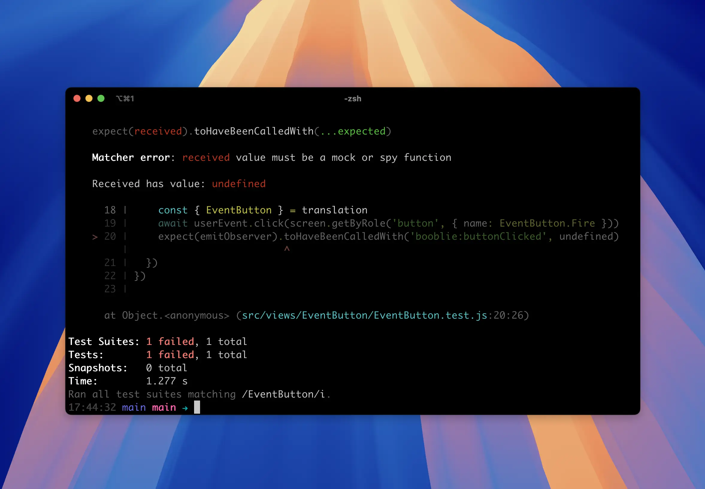

title: Renderizando componentes que usam communication e translation
date: 2025-10-16
description: Esta receita apresenta uma estratégia para resolver o dilema entre as funções renderWithTranslation e renderWithCommunication quando um teste precisa usar simultaneamente as funcionalidades de tradução e comunicação do Front-hub.
keywords: renderização, communication, translations, front-hub, testes automatizados

---

Eventualmente você vai precisar emitir ou ouvir eventos com auxílio da funcionalidade [useCommunication](https://front-hub.rdstation.com.br/docs/communication) do Front-hub. Isso pode fazer você se deparar com um dilema nos testes.

1. Se você usar a função `renderWithTranslation` vai ter as traduções do componente renderizadas nos testes, mas não vai dispor das funções auxiliares `fireEmit` e `emitObserver`.
2. Se você usar a função `renderWithCommunication` vai ter acesso às funções auxiliares `fireEmit` e `emitObserver`, mas as traduções não serão renderizadas.

  
*Erro lançado no terminal quando você tentar usar a função emitObserver depois de renderizar o componente do teste com a função renderWithTranslation.*

Para resolver o dilema sem que você precise ora usar `renderWithTranslation`, ora usar `renderWithCommunication`, basta adotar a seguinte estratégia:

1. Crie um módulo chamado `testing.js` e exporte a partir dele todas as funções auxiliares comumente necessárias em testes (*testing library, user events, etc*).
2. Exporte uma função chamada `customRender`, contendo a implementação a seguir.

``` javascript
import i18next from 'i18next'
import { initReactI18next, I18nextProvider } from 'react-i18next'
import { act } from '@testing-library/react'
import * as fronthubJest from '@resultadosdigitais/front-hub/react/jest'
export * from '@testing-library/react'
export { default as userEvent } from '@testing-library/user-event'

export async function customRender(component, { translation, frontHubConfig }) {
  let result
  await act(async () => {
    const i18n = await initI18Next(translation)
    result = await fronthubJest.renderWithCommunication(
      <I18nextProvider i18n={i18n}>
        {fronthubJest.instanceMock(component, frontHubConfig)}
      </I18nextProvider>,
    )
  })
  return result
}

function initI18Next(translation) {
  return new Promise(resolve => {
    const instance = i18next.createInstance()
    instance.use(initReactI18next)
    instance.init(buildOptions(translation), () => resolve(instance))
  })
}

function buildOptions(translation) {
  return {
    lng: 'pt-BR',
    resources: {
      pt: {
        translation,
      },
    },
    react: {
      useSuspense: false,
    },
  }
}
```

Pronto! Esta implementação te permite agora importar apenas a função `customRender` em suas suites de teste. Ela disponibilizará automaticamente as funções auxiliares para disparar/ouvir eventos, uma vez que ela se baseia na função `renderWithCommunication`, e também as traduções associadas ao componente, uma vez que ela enriquece a renderização com o *provider* de tradução da biblioteca `i18next`.

Veja abaixo um exemplo de teste que usa a função `customRender` e certifica que um determinado evento é disparado quando um botão renderizado pelo teste é clicado:

``` javascript
import {
  customRender,
  userEvent,
  screen,
} from 'path/to/testing/module'
import translation from './locales/pt-BR.json'
import MyComponent from './MyComponent'

describe('My Component', () => {
  async function mount() {
    return await customRender(<MyComponent />, { translation })
  }

  it('should fire an event on button click', async () => {
    const { emitObserver } = await mount()
    const { MyComponent } = translation
    await userEvent.click(
      screen.getByRole('button', { name: MyComponent.Fire }),
    )
    expect(emitObserver).toHaveBeenCalledWith(
      'my-mfe-name:buttonClicked',
      undefined,
    )
  })
})
```

Você pode conferir a implementação completa deste teste [aqui](https://github.com/ResultadosDigitais/booblie/blob/4cd5f14a3073cde91cd5f7583c615c71901a9a6f/packages/main/src/views/EventButton/EventButton.test.js).
