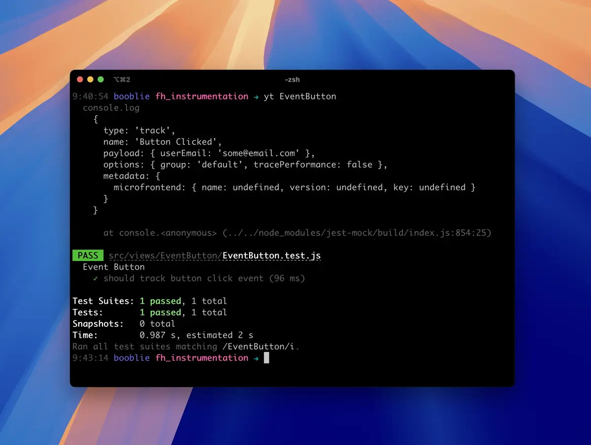

title: Testando trackings feitos com useInstrumentation
date: 2026-01-19
description: Esta receita explora o teste de trackings com useInstrumentation sem poluir o terminal nem comprometer a confiabilidade dos testes, evitando armadilhas comuns com spyOn e mocks de módulos.
keywords: useInstrumentation, Front-hub, testes automatizados, spyOn, console, log, mock

---

Embora bastante simples, a tarefa de testar *trackings* pode acabar sendo feita de maneiras que prejudicam a experiência de execução da suíte ou minam o nível de confiança do teste. Veja a seguir dois testes que exemplificam cada um destes problemas:

## Evitando poluir o terminal com spyOn

``` javascript
it('should track button click event', async () => {
  jest.spyOn(console, 'log')
  const email = 'some@email.com'
  const frontHubConfig = { context: { user: { email } } }
  await mount({ frontHubConfig })
  await userEvent.click(
    screen.getByRole('button', { name: 'Disparar' }),
  )
  expect(console.log).toHaveBeenCalledWith(
    expect.objectContaining({
      name: 'Button Clicked',
      type: 'track',
      payload: {
        userEmail: email,
      },
    }),
  )
})
```

Diferentemente do `jest.fn`, o utilitário `spyOn` nos permite observar o uso de alguma função sem alterar a implementação dela. Isso significa que se eu tentar garantir o disparo de um track "espiando" a função `console.log` (usada pelo useInstrumentation em ambiente de desenvolvimento/testes), o terminal vai logar todos os eventos que estiverem disparando algum track.

  
*Log indesejado durante a execução do teste*

Como é possível verificar na imagem acima, os logs interrompem o feedback da execução dos testes para avisar algo que não precisamos saber. Na medida em que uma aplicação vai ganhando mais e mais tracks, a quantidade de informações desnecessárias sendo escritas no terminal pode se tornar extremamente desconfortável.

## Evitando reduzir o nível de confiança do teste

``` javascript
jest.mock('@resultadosdigitais/front-hub/react', () => ({
  ...jest.requireActual('@resultadosdigitais/front-hub/react'),
  useInstrumentation: jest.fn(),
}))
```

Se a estratégia for fazer um mock da função `useInstrumentation` diretamente no módulo `@resultadosdigitais/front-hub/react`, essa suíte de teste poderá estar reduzindo significativamente seu nível de confiança. Esse nível de confiança diminui porque ao fazer o mock de um módulo, seu conteúdo real não será mais injetado na implementação. O que será injetado será o que foi definido na suíte de teste.

A ameaça real dessa estratégia é que, em algum momento futuro, o teste pode continuar passando enquanto, na verdade, deveria quebrar. Por exemplo, caso esse pacote seja atualizado e a nova versão não ofereça mais a função `useInstrumentation` por conta de uma mudança na sua API, nenhum teste será atingido pela quebra de compatibilidade, já que a implementação real do módulo não está sendo utilizada no teste.

## Garantindo o comportamento mais próximo da realidade

Ainda que as seções acima possam ter feito parecer que testar trackings de maneira confiável é algo complexo, esta é entretanto uma tarefa extremamente simples.

Ao invés de usar `spyOn` ou fazer um mock de todo o módulo `@resultadosdigitais/front-hub/react`, basta que seja feito o mock da função `console.log`:

``` javascript
beforeEach(() => {
  console.log = jest.fn()
});

it('should track button click event', async () => {
  const email = 'some@email.com'
  const frontHubConfig = { context: { user: { email } } }
  await mount({ frontHubConfig })
  await userEvent.click(
    screen.getByRole('button', { name: 'Disparar' }),
  )
  expect(console.log).toHaveBeenCalledWith(
    expect.objectContaining({
      name: 'Button Clicked',
      type: 'track',
      payload: {
        userEmail: email,
      },
    }),
  )
})
```

Dessa forma, nenhum log indesejado é lançado no terminal e, caso a API da biblioteca mude a ponto de se tornar incompatível com o jeito que está sendo usada no projeto, o teste certamente vai quebrar, mantendo assim o nível de confiança que se deseja dele.

Você pode conferir a implementação completa deste teste [aqui](https://github.com/ResultadosDigitais/booblie/blob/65d47bf224f58e5262a42ca8d191f98115422882/packages/main/src/views/EventButton/EventButton.test.js).
